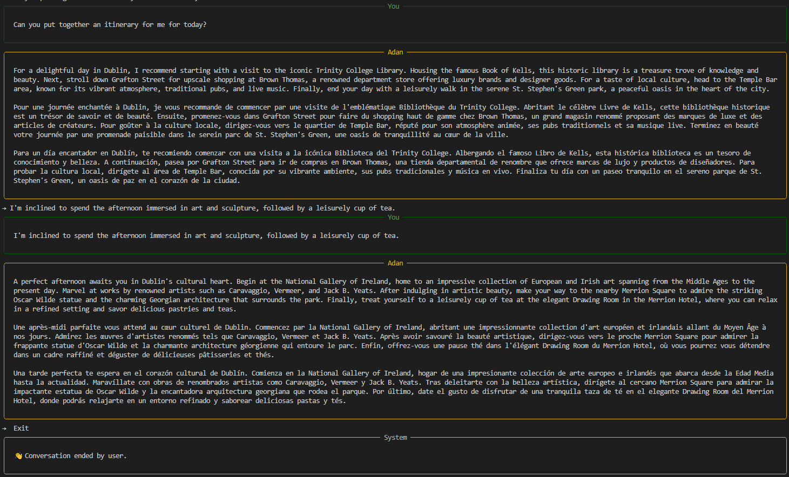

# Cultural Concierge AI

*Cultural guidance with timeless elegance, powered by Python and the OpenAI API.*

---


---

## Overview
**Cultural Concierge AI** is an intelligent assistant offering **refined cultural recommendations, professional etiquette guidance, and networking insights**.  

With a particular emphasis on **Ireland**, the project bridges **tradition and technology**, delivering experiences that embody cultural depth and modern sophistication.

---

## Features
- **Cultural guidance**: curated suggestions for museums, exhibitions, literature, and classical music.  
- **Professional etiquette**: insights into networking, dining protocol, and business formality.  
- **Irish focus**: heritage, history, and traditions presented with nuance and elegance.  
- **Trilingual refinement**: all responses are delivered in **English, French, and Spanish**.  
- **Technology**: developed in Python, powered by the [OpenAI API](https://platform.openai.com).  

---

## Demo

Example prompt:
```text
→ What can I do today in Dublin?
```

Assistant reply:
```
Begin your day at the National Gallery of Ireland, followed by a walk through Trinity College and its historic library. In the evening, enjoy a performance at the National Concert Hall.

Commencez la journée à la Galerie nationale d’Irlande, poursuivez par une promenade au Trinity College et sa bibliothèque historique. Terminez avec un concert au National Concert Hall.

Empiece el día en la Galería Nacional de Irlanda, continúe con un paseo por el Trinity College y su biblioteca histórica, y finalice con un concierto en el National Concert Hall.
```

Here is a short demonstration of the console assistant:



---

## Version
**Current release:** `0.1.0` — Initial public version (console-based prototype).  
Stable enough for demonstration purposes; not production-ready.

## Development Roadmap
- [x] Rich UI with refined “chat bubbles” in console.  
- [x] Mock mode for free local testing without API costs.  
- [ ] CLI commands with Typer (`plan`, `etiquette`, `networking`).  
- [ ] GitHub Actions for tests and linting.  
- [ ] Example transcripts for Dublin and Limerick.  
- [ ] Minimal web demo (FastAPI) with sober aesthetics.  
- [ ] Documentation on etiquette, networking, and cultural recommendations.  
- [ ] Packaging for distribution (`pip install cultural-concierge-ai`).  
- [ ] Multi-session persistence (save transcripts with timestamps).  

---

## Getting Started

### Requirements
- Python 3.10+  
- [OpenAI Python library](https://pypi.org/project/openai/)  
- Optional: `inputimeout`, `typer`, `rich`

### Installation
```bash
git clone https://github.com/MrsDaraCode/cultural-concierge-ai.git
cd cultural-concierge-ai
pip install -r requirements.txt
```

### Configuration
Create a `.env` file or use `confi.py` with the following variables:
```bash
OPENAI_API_KEY=your_api_key_here
OPENAI_MODEL=gpt-5-nano   # or gpt-4o-mini, etc.
USE_MOCK=true             # true = free simulation mode, false = real API
```

### Usage
Run the assistant:
```bash
python src/main.py
```

Exit commands: `exit`, `quit`, `salir`  
If no input is given within 60 seconds, the conversation ends automatically.

---

## License
This project is licensed under the [MIT License](LICENSE).  

© 2025 Dara Andrés López. All rights reserved.
